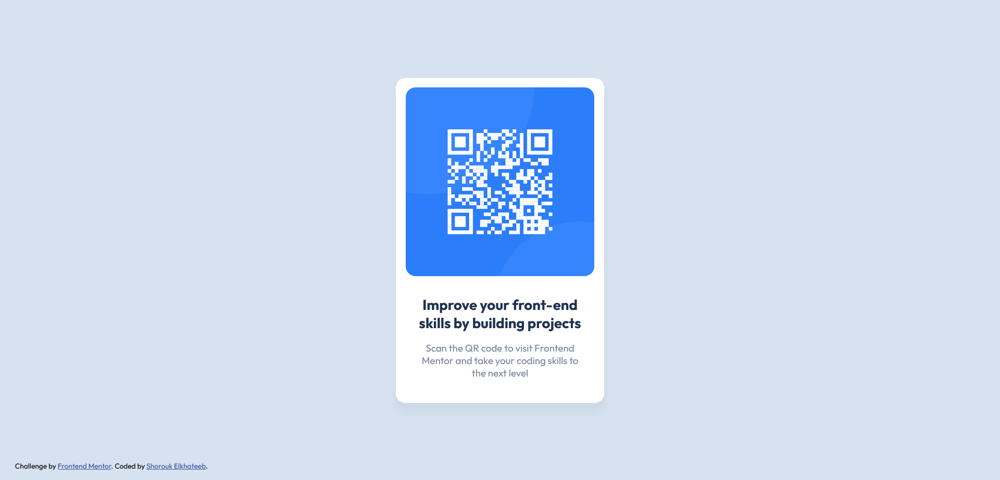

# Frontend Mentor - QR code component solution

This is a solution to the [QR code component challenge on Frontend Mentor](https://www.frontendmentor.io/challenges/qr-code-component-iux_sIO_H). Frontend Mentor challenges help you improve your coding skills by building realistic projects. 

## Table of contents

- [Overview](#overview)
  - [Screenshot](#screenshot)
  - [Links](#links)
- [My process](#my-process)
  - [Built with](#built-with)
  - [What I learned](#what-i-learned)
  - [Useful resources](#useful-resources)
- [Author](#author)

## Overview

### Screenshot



### Links

- Solution URL: [https://github.com/shElkhateeb/qr-component-main](https://github.com/shElkhateeb/qr-component-main)
- Live Site URL: [https://shelkhateeb.github.io/qr-component-main/](https://shelkhateeb.github.io/qr-component-main/)

## My process

### Built with

- Semantic HTML5 markup
- CSS custom properties
- Flexbox

### What I learned

```css
.card {
  box-shadow: 0 15px 10px hsla(219, 15%, 55%, 0.096);
}
```

### Useful resources

- [CSS box-shadow Property](https://www.w3schools.com/cssref/css3_pr_box-shadow.php).

## Author

- Frontend Mentor - [Shorouk Elkhateeb](https://www.frontendmentor.io/profile/shElkhateeb)